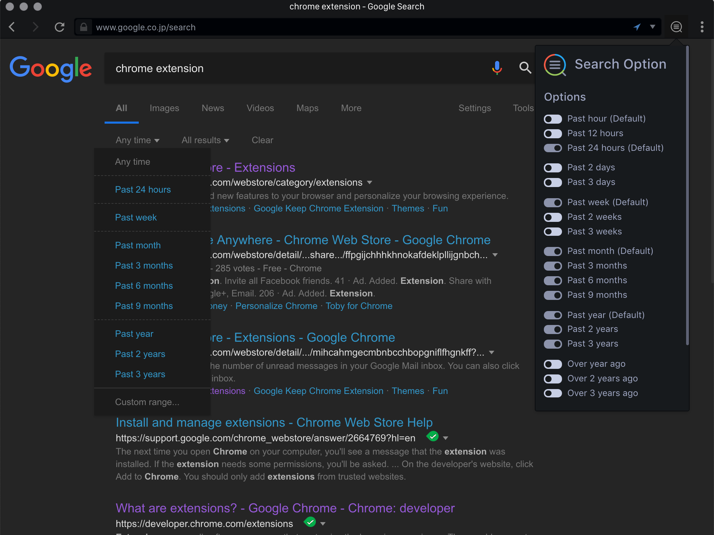

#  Search Option
Chrome Extension for customizing Google Search option.

# Overview

This extension adds date range options to Google search. Each item can be easily switched, and it also supports dark mode.

# Installation

Install via [Chrome Web Store](https://chrome.google.com/webstore/detail/1password-extension-deskt/xxxxxxxxxxxxxxxxxxxxxxxx). Otherwise, you can [install manually from source](https://github.com/web-scrobbler/web-scrobbler/wiki/Install-an-unpacked-extension).

# Copyright

Search Option is released under MIT license, which means you can modify it, redistribute it or use it however you like.
